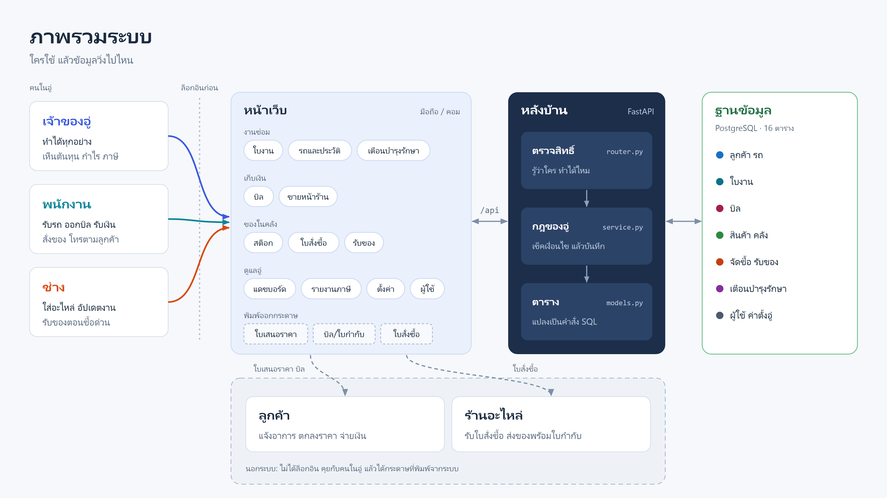
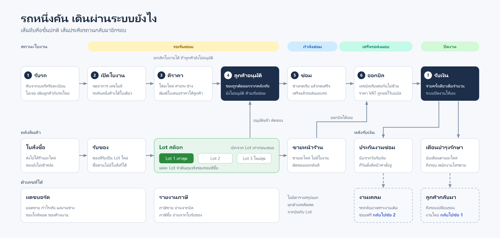
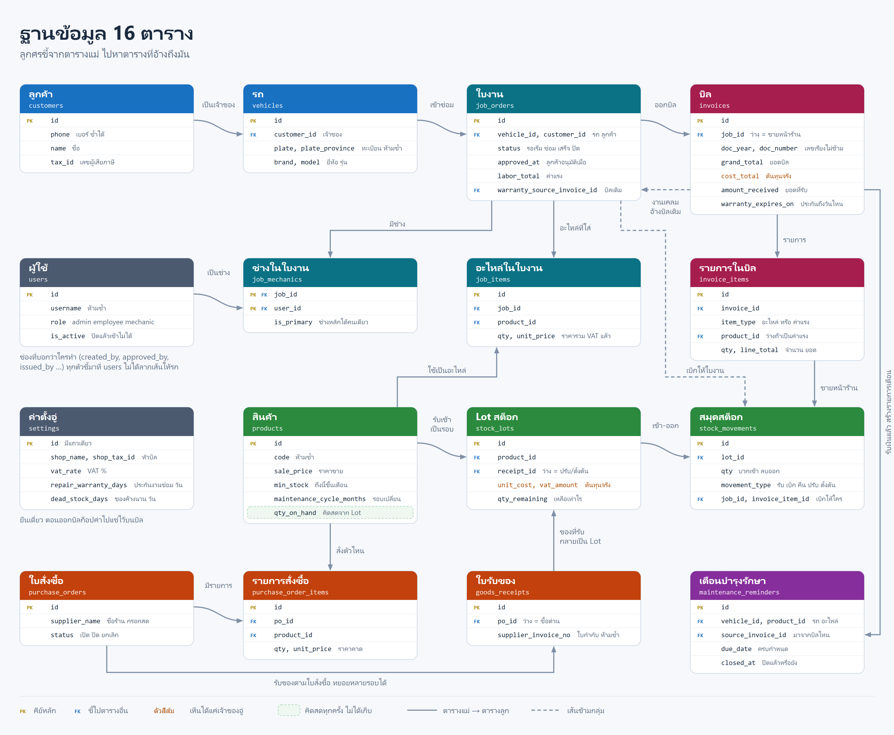
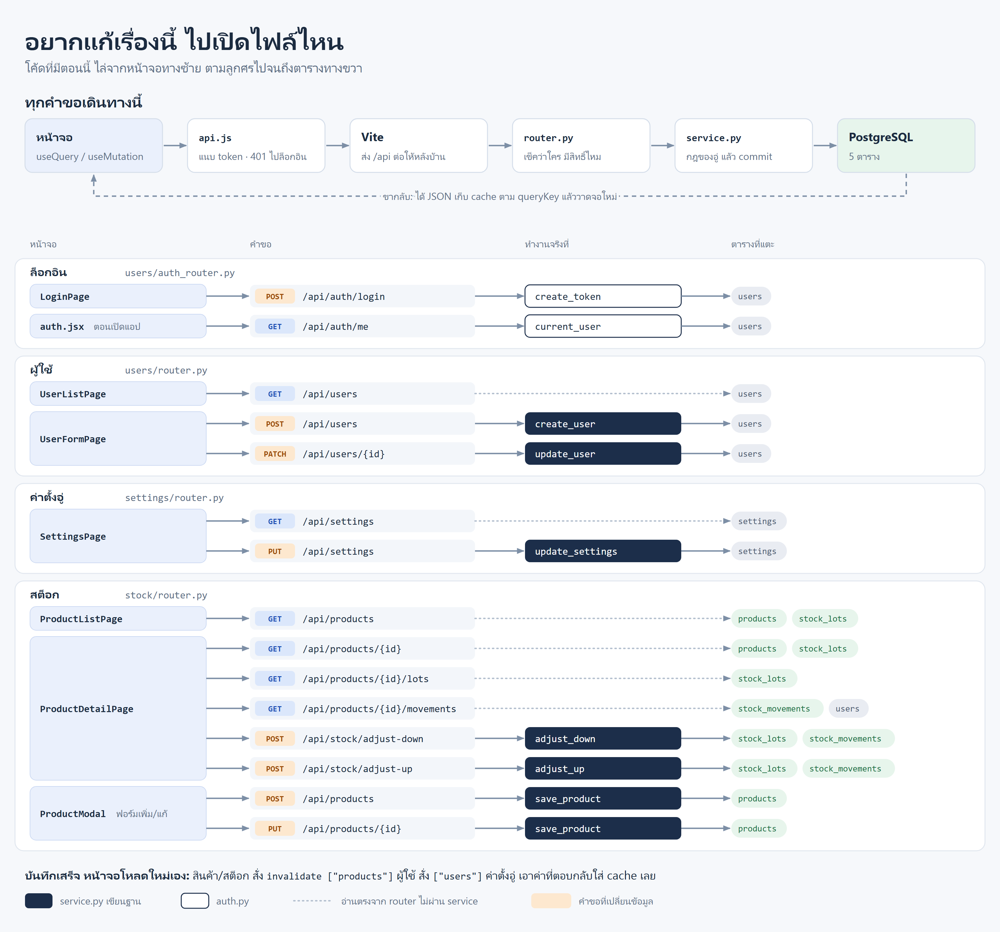

# ภาพระบบ

สามภาพแรกเป็นระบบตอนเสร็จครบ ภาพสุดท้ายเป็นโค้ดที่มีอยู่ตอนนี้

## ภาพรวมระบบ

ขนาด 16:9 ใส่สไลด์ได้เลย



## รถหนึ่งคัน เดินผ่านระบบยังไง



## ฐานข้อมูล 16 ตาราง



## อยากแก้เรื่องนี้ ไปเปิดไฟล์ไหน



## แก้ภาพ

แก้ไฟล์ `.svg` (เป็นข้อความธรรมดา) แล้วสร้าง PNG ใหม่ด้วย Edge · กว้าง/สูงดูจากบรรทัดแรกของไฟล์ svg

```
msedge --headless=new --force-device-scale-factor=2 --window-size=1920,1080 --screenshot=system-overview.png system-overview.svg
```
